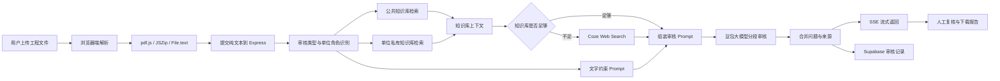

# 政企工程文件 AI 智能审核助手（RAG 架构优化）

面向政企工程资料、施工内业资料、抽水蓄能电站技术文件和公文报审材料的 AI 审核 Demo。项目目标不是替代人工审批，而是把“人工逐页查规范、找依据、标问题”的重复工作，改造成“文档解析 + 知识库检索 + 大模型审核 + 来源引用 + 人工复核”的半自动闭环。

> 当前仓库是在线演示版本：`Vite + TypeScript + Express + Supabase + Coze Knowledge + Coze Web Search + 豆包大模型`。  
> 简历中的私有化 RAG 版本可将知识库层替换为 `Python + ChromaDB + BM25/RRF + bge-small-zh + llama.cpp`，业务流程和审核界面保持一致。

## 项目定位

这个项目适合作为“工程文件审核助手”的 MVP / PoC，用来验证三件事：

1. 工程文件能否被稳定解析成可审核文本。
2. AI 能否结合知识库、提示词和联网搜索生成可复核的审核意见。
3. 审核结果能否沉淀为记录、来源和问题清单，方便后续人工确认。

典型使用场景：

- 施工方案、技术交底、报审单、公文材料的初步审核。
- 总包、监理、施工单位按不同视角执行差异化审核。
- 管理员维护公共知识库和单位私有审核依据。
- 审核人员查看历史记录、下载问题报告、追溯知识来源。

## 解决的业务问题

传统工程文件审核通常存在这些痛点：

- 审核周期长：人工逐页查规范、查签字、查条款，容易从小时级拖到天级。
- 漏项风险高：签章、日期、编号、附件、规范版本、技术参数等细节容易被忽略。
- 审核口径不统一：总包、监理、施工单位关注点不同，同一问题判断标准可能不一致。
- 依据难追溯：只有结论没有来源，后续解释、整改和复核成本很高。

本系统把工程资料先转成文本，再按审核类型检索对应知识库，最后由大模型生成结构化审核结果，帮助审核人员快速定位问题和依据。

## 核心功能

### 文件解析与分段审核

- 支持 PDF、Word、图片、纯文本等文件入口。
- 前端优先解析文件内容，仅向后端提交纯文本，降低文件传输和后端解析风险。
- 大文件按章节或固定长度分段审核，再合并结论，避免长文本超出模型上下文。
- 报审单单独识别，重点检查签字栏、日期逻辑、签章、监理签认和格式规范。

### 多角色工程审核

- 总包单位：关注 EPC 管理、设计施工一致性、分包管理、质量安全体系。
- 监理单位：关注合规性、质量、安全、危大工程、过程管控和应急度汛。
- 施工单位：关注施工工艺、资源配置、质量控制、安全措施和进度安排。

### 知识库增强问答

- 公共知识库：人员资质、企业资质、技术文件、安全检查、公文审核、通用法规。
- 单位私有知识库：按总包、监理、施工单位隔离审核依据。
- 检索优先级：文字约束 Prompt → 公共知识库 → 单位私有知识库 → 联网搜索。
- 知识库不足时自动触发联网搜索，补充最新法规和标准信息。

### 结构化审核结果

- 输出审核结论、综合评分、问题清单、整改建议、详细分析和参考来源。
- 问题按格式错误、错别字、过期规范、参数不合规、内容缺失等类型分类。
- 支持 SSE 流式响应，实时展示“启动、检索、分段审核、完成”等进度。
- 审核历史写入 Supabase，支持管理员查看全量记录，普通用户仅查看个人记录。

## 技术架构



## 当前仓库技术栈

| 层级 | 技术 | 说明 |
|---|---|---|
| 前端 | Vite + TypeScript + Tailwind CSS | 单页应用、文件解析、审核结果展示 |
| 后端 | Express + TypeScript | API、SSE 流式审核、知识库调用 |
| 文件解析 | pdf.js + JSZip | PDF / Word / 文本解析 |
| 数据库 | Supabase PostgreSQL | 用户账号、审核历史、知识库文件记录 |
| 知识库 | Coze Knowledge | 公共知识库 + 单位私有知识库 |
| 联网搜索 | Coze Web Search | 知识库不足时补全法规信息 |
| 大模型 | doubao-seed-2-0-pro | 分类标注、审核结论、整改建议 |
| 包管理 | pnpm | 项目依赖和脚本管理 |

## 私有化 RAG 改造映射

为了适配政企内网、数据安全和本地模型部署，可以把当前 Coze 知识库链路替换成自研 RAG 链路：

| 当前在线演示版 | 私有化 RAG 版本 | 作用 |
|---|---|---|
| Coze Knowledge | ChromaDB 向量库 | 存储工程资料 chunk 和向量 |
| Coze Knowledge 检索 | bge-small-zh Embedding | 中文语义检索 |
| 关键词/知识库匹配 | BM25 + jieba | 命中条款编号、专业词、规范号 |
| 单路知识库召回 | BM25 + 向量检索 + RRF | 多路召回融合，提升稳定性 |
| 豆包云端模型 | llama.cpp + GGUF 本地模型 | 支持离线或内网推理 |
| Coze Web Search | 内部规范库 / 人工补录 | 避免外网依赖 |
| 后端 Prompt 组装 | Python / FastAPI RAG 服务 | 可独立部署为内部知识库服务 |

简历表述可以说：

> 当前 Demo 跑通了工程文件解析、模块化知识库检索、SSE 流式审核、来源引用和审核记录闭环；私有化版本可替换为 Python + ChromaDB + BM25/RRF + llama.cpp 的 RAG 架构，用于内网知识库问答和工程资料预审。

## 项目结构

```text
├── public/                  # 静态资源
├── server/                  # Express 后端
│   ├── routes/index.ts      # 认证、审核、知识库、用户管理 API
│   ├── src/storage/         # Supabase 数据库客户端
│   ├── vite.ts              # Vite 开发中间件
│   └── server.ts            # 服务入口
├── src/                     # 前端源码
│   ├── main.ts              # 主应用逻辑
│   ├── index.ts             # 入口文件
│   ├── index.css            # 全局样式
│   └── storage/database/    # 数据库 schema
├── scripts/                 # 构建/开发脚本
├── USAGE.md                 # 使用说明
├── BUGS.md                  # 问题与修复记录
├── AGENTS.md                # 项目规范
└── package.json
```

## 快速开始

### 环境要求

- Node.js 24+
- pnpm 9+

### 安装与运行

```bash
pnpm install
pnpm dev
```

默认开发服务端口：`5000`。

### 构建

```bash
pnpm build
pnpm start
```

### 环境变量

| 变量名 | 说明 |
|---|---|
| `COZE_SUPABASE_URL` | Supabase 项目地址 |
| `COZE_SUPABASE_ANON_KEY` | Supabase 匿名密钥 |
| `COZE_SUPABASE_SERVICE_ROLE_KEY` | Supabase 服务端密钥 |
| `DEPLOY_RUN_PORT` | 服务端口，默认 5000 |

## API 概览

| 方法 | 路径 | 说明 |
|---|---|---|
| `POST` | `/api/auth/login` | 登录 |
| `POST` | `/api/auth/register` | 注册 |
| `POST` | `/api/review` | 提交文件审核，SSE 流式返回 |
| `GET` | `/api/reviews` | 获取审核历史 |
| `POST` | `/api/knowledge/import` | 导入知识库文档 |
| `POST` | `/api/knowledge/search` | 测试知识库搜索 |
| `GET` | `/api/knowledge/datasets` | 获取知识库数据集 |
| `POST` | `/api/web-search` | 联网搜索 |
| `GET/POST/PUT/DELETE` | `/api/users` | 用户管理，仅管理员 |

## 默认账号

| 用户名 | 密码 | 角色 |
|---|---|---|
| `admin` | `123456` | 管理员 |

部署后请立即修改默认密码。

## 面试讲法

如果面试官问这个项目，可以按下面口径回答：

> 我做的是一个工程文件 AI 审核助手，最初目标是验证工程资料审核能否从人工查规范，转成 AI 先给出问题清单和依据，人工再复核。  
> 当前仓库是在线演示版本，前端负责 PDF/Word 文档解析，后端用 Express 做 SSE 流式审核，知识库层接了 Coze Knowledge 和联网搜索，审核结果存 Supabase。  
> 如果放到政企内网，我会把 Coze Knowledge 替换为 Python RAG 服务，用 ChromaDB 存向量，BM25 解决条款和规范号检索，RRF 融合多路召回，模型层换成 llama.cpp 本地 GGUF 模型。这样业务界面和审核流程不变，只替换检索和模型底座。

被追问时可以展开：

- 为什么前端解析文件：减少后端文件上传和解析失败风险，后端只处理纯文本。
- 为什么需要分段审核：工程文件很长，直接塞给模型容易超上下文，需要按章节分段再合并。
- 为什么要知识库：工程审核必须有依据，不能只靠模型自由发挥。
- 为什么还要联网搜索：知识库可能滞后，联网搜索只做低优先级补充，冲突时以知识库为准。
- 为什么私有化要用 ChromaDB/BM25/RRF：向量适合语义，BM25 适合条款编号和专有名词，RRF 用于融合排序。

## 项目边界

- 当前项目是 MVP / PoC，不建议直接宣称已替代正式审批系统。
- 大模型输出必须由人工复核，尤其是工程合规、质量安全和合同类结论。
- 生产化还需要补充权限审计、日志监控、OCR、数据备份、并发压测和人工确认流。
- 仓库中的示例文档仅用于功能验证，不应包含真实敏感工程资料。

## License

MIT
